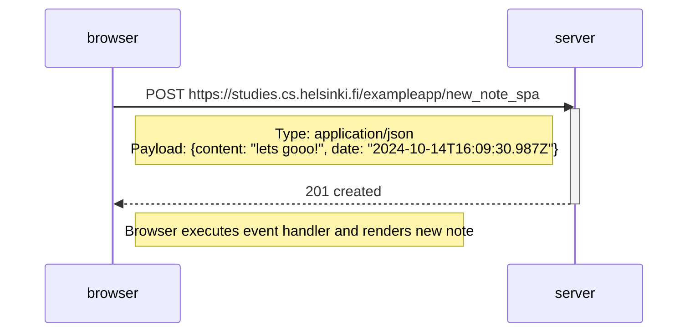

```mermaid
sequenceDiagram
participant browser
participant server

browser->>server: POST https://studies.cs.helsinki.fi/exampleapp/new_note_spa
    activate server
    Note right of browser: Type: application/json <br> Payload: {content: "lets gooo!", date: "2024-10-14T16:09:30.987Z"}

    server-->>browser: 201 created
    deactivate server
    Note right of browser: Browser executes event handler and renders new note


```
